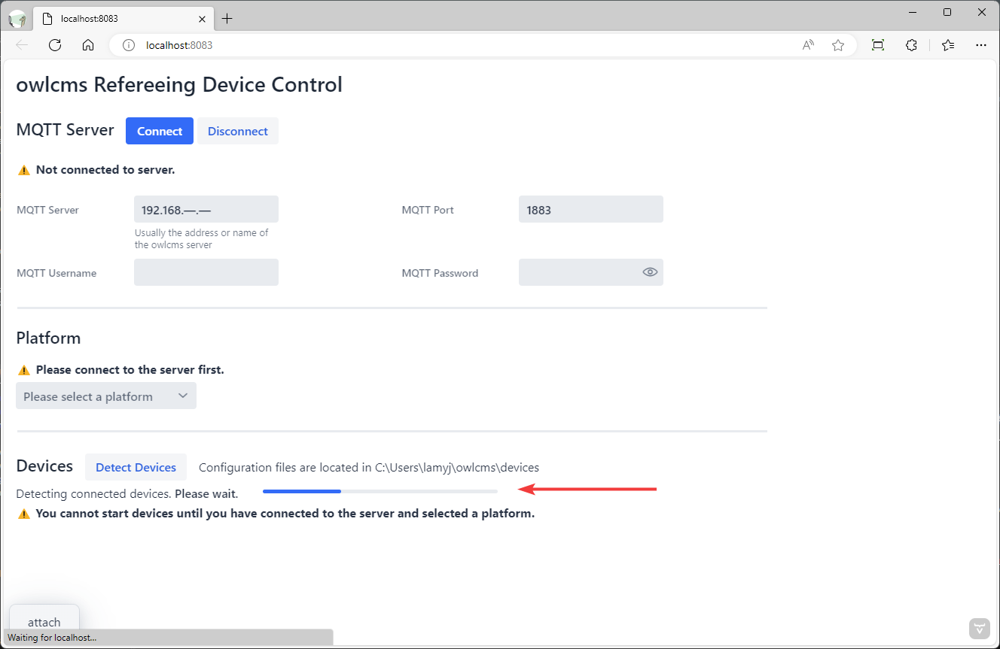
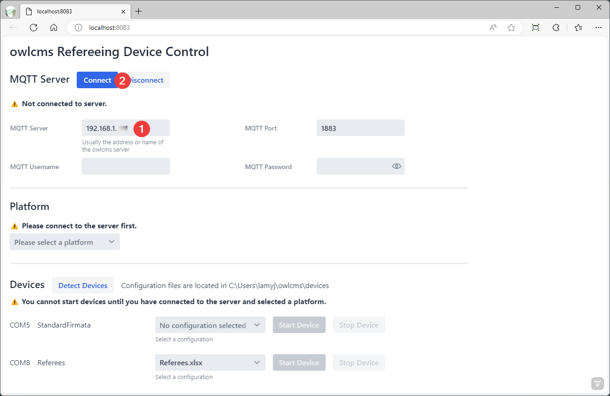
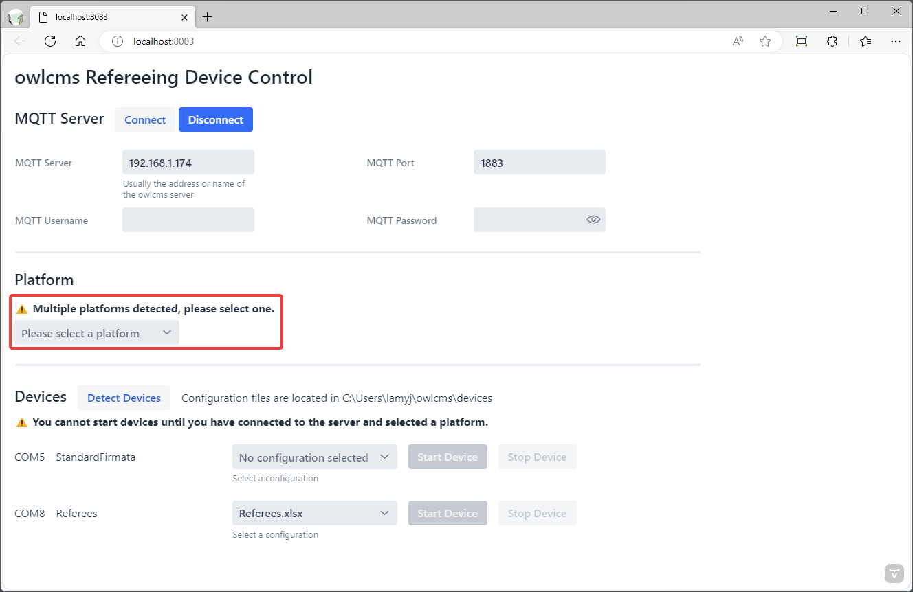
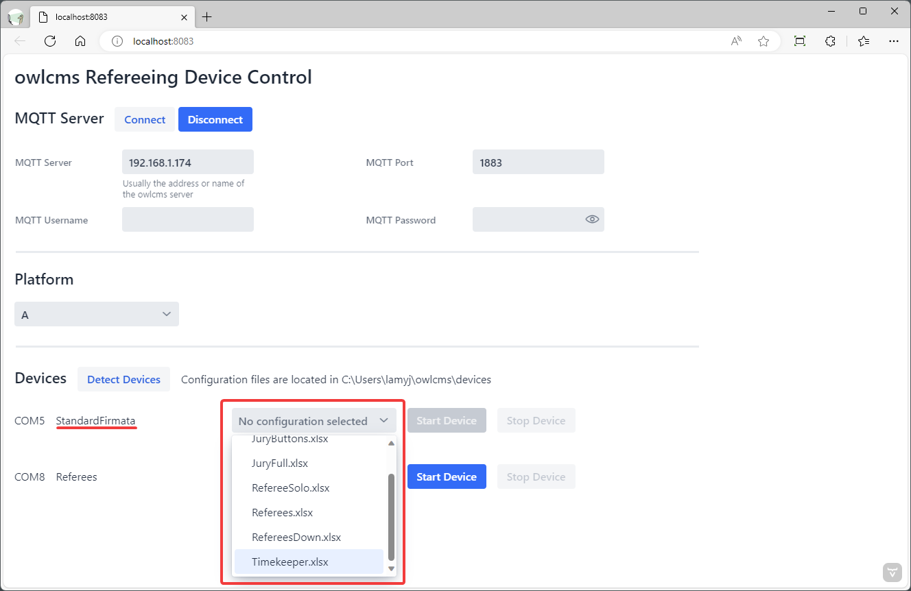
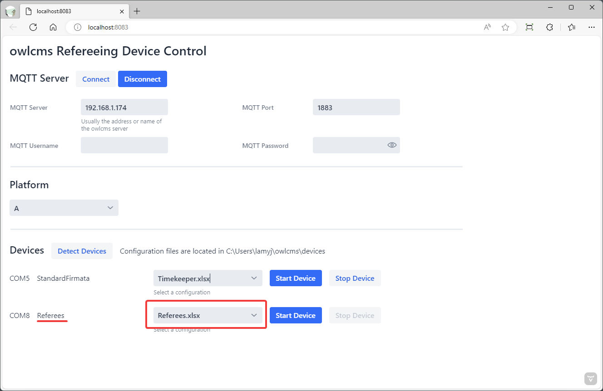

# owlcms-firmata Program Instructions

The owlcms-firmata program controls devices using Excel configuration files.  This allows for builders to change which pins are used on the Arduino board, and to create new devices according to their needs - for example, to create an announcer device with red/white and challenge buttons.

## Installation

These instructions refer to version 2.0. The program is obtained from the [releases directory](https://github.com/jflamy/owlcms-firmata/releases).  

##### To run on Windows,  download and run the `.exe` installer.

- This will create a desktop icon and start menu entries.
- To uninstall, use the standard "Installed apps" system settings menu.

##### To run on macOS, Linux or RaspberryOS

> [!IMPORTANT]
>
> Java is required to run the program. RaspberryOS includes Java.  For MacOS and Linux, you have to install Java 17 once, beforehand.
>
> - For MacOS: Instructions for installing Java are found [here](https://adoptium.net/installation/macOS/).    You can download the .pkg file from [here](https://adoptium.net/temurin/releases/) -- select aarch64 if you have a recent M1 or M2 Mac. The JRE package is sufficient. 
>
> - For Linux, OpenJDK is available as an apt package (`openjdk`)

Then download the `.jar` file from the releases directory and run.

```
java -jar owlcms-firmata.jar
```

## Device Configuration Files

When the program is started for the first time, it creates a subdirectory in the user's home directory. The subdirectory is called `owlcms\devices` on Windows and `.owlcms/devices` on Mac and Linux/RaspberryOS.

The format for configuration files is documented [here](https://github.com/jflamy/owlcms-firmata/blob/v24/diagrams/CONFIGURATION.md) .

> [!NOTE]
>
> The configuration files are NOT changed or updated by subsequent installations.
>
> You can delete configuration files you don't need, and you can rename the files to whatever you want.
>
> If you want to get the default configuration files again, you need to delete the devices directory and restart the program (make a copy of your old files just in case).

## Running the Program

### 1. Initial Device Detection

When the program is started, it will attempt to detect your connected devices.  If your devices are not yet connected, you can use the `Detect Devices` button later.



### 2. Connecting to the server

After the detection step, the devices found are listed at the bottom, but they cannot be activated since we are not connected to owlcms.

The next step is to connect to the server.  Normally you will use the address of *your own owlcms server* and the default parameters (port 1883, and no username/password).



### 3. Platform Selection

The program will then interrogate owlcms to see if there are multiple platforms in use.  If so, you will be asked to select which one.  If there is only one, this step is automatic.



### 4. Selecting a Device Configuration

If the person building the device used the standard firmware for the Arduino Board, you need to select which configuration to use from the files in the configuration directory.  After selection, the `Start Device` button becomes enabled.



### 5. Pre-selected Device Configuration

The person building the device can copy the standard firmware and name it the same as a configuration file.  When that is the case, the name of the configuration file is pre-selected, and the start button is already enabled.



### 6. Detecting Devices Again

If you plug or unplug devices, you can scan again by using the `Detect Devices` button.  It may happen that the Device Detection does not see all the devices.  You may try again after waiting a few seconds. If that fails, stopping the program and restarting it again typically solves the issue (Windows is sometimes a little bit finicky about USB serial ports)