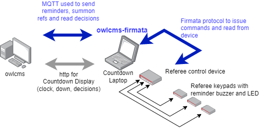

# owlcms-firmata
User-configurable device driver for [owlcms](https://owlcms.github.io/owlcms4-prerelease/#/index) refereeing devices built with Arduino (or similar) boards. This program relays commands from owlcms to the board and sends events from the board back to owlcms.  The program can handle fully IWF-conpliant Timekeeper, Referee and Jury Devices.  The refereeing control device can also control an external tower for down signal sound and buzzer.

This program allows hobbyists to build their own devices and change pin assignments as required.  Any board that can be loaded with  [Firmata](https://github.com/firmata/protocol) can be used - the board is loaded once with the firmware and is not touched afterward.

The pin configuration for a device is read from an Excel spreadsheet.  

- Each pin number can be mapped to a button and the MQTT message to be sent when the button is pressed is defined.
- Conversely, an MQTT message received can be mapped to one or more pins.  For each pin the expected action is given -- turning the pin on or off, flashing the pin, emitting a tone, triggering a relay. 

Schematics for building devices can be found in the `diagrams` folder in this repository. Instructions for using the [Wokwi](https://docs.wokwi.com) Arduino simulator together with this program as also given: this allows running the design live with owlcms before building it. The pin allocations for these diagrams are built-in, you can use your own by simply copying your own Excel to the installation directory.  The program also supports the pin allocation for commercial devices being developed by the [Blue-Owl](https://github.com/scottgonzalez/blue-owl) project. 

**Credit** The idea and incentive for this program come from the [Blue-Owl](https://github.com/scottgonzalez/blue-owl) project by Scott González.   
