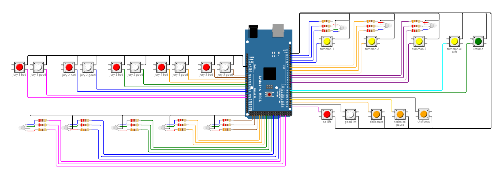

## Fully TCRR-compliant Jury Device

This folder describes a full TCRR device with all the indicator LEDs.

It can be used when the jury prefers looking at the scoreboard instead of the owlcms Jury page. A laptop is still required on the jury table to provide power and act as go-between the device and owlcms.  Because of the number of LEDs, an Arduino-Mega is used to provide the required number of pins.

The following wokwi project contains the interactive version of the diagram, that you can save as your own and modify. See the instructions in [../diagrams/README.md](../diagrams/README.md) if you wish to change the diagram or run the simulated device.

https://wokwi.com/projects/352943774351361025