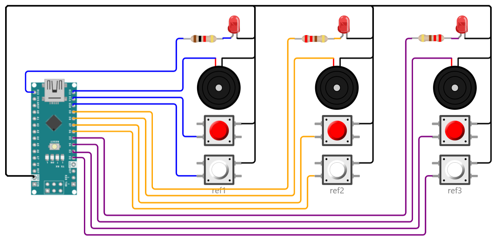

## Simple Refereeing Box

This folder describes a device used in conjunction with a laptop that gives a down signal and sound.

The individual referees get a buzzer and LED reminder.  You can remove these if you just want referee buttons and a simpler build.

See https://wokwi.com/projects/353212897007580161 for the interactive diagram. See the instructions in [../README.md](../README.md) if you wish to change the diagram or run the simulated device.

