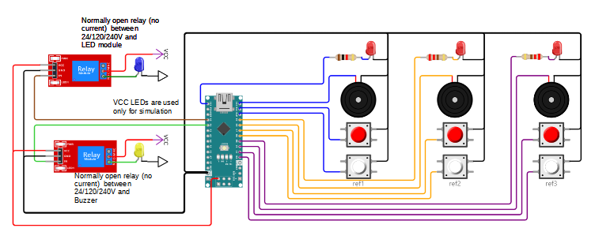

## Full TCRR-compliant Refereeing Box with External Down Signal light and buzzer

This folder describes a complete refereeing box that can trigger a down signal.

You can also use this diagram to create a separate device for the down signal by only using the left-hand part.

See https://wokwi.com/projects/354593337853679617 for the interactive diagram. See the instructions in [../README.md](../README.md) if you wish to change the diagram or run the simulated device.

Notes:

- In the diagram, a blue LED represents the down signal light (relay triggered by pin A0) and the yellow LED represents the buzzer (relay triggered by pin A1)

- Most commercial signal tower components exist in a 24V variant. See for example [this offering](https://www.superbrightleds.com/single-color-led-light-module-for-signal-tower-stack-light#tab-all-accessories) which is interesting because an individual white light module can be bought 
