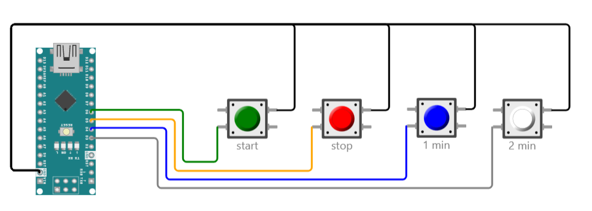

This folder describes simple time-keeping buttons that can be connected to the announcer laptop, or to the timekeeper laptop if one is used.

The interactive diagram for this board can be found at
https://wokwi.com/projects/353216754939098113

See the instructions in [../diagrams/README.md](../diagrams/README.md) if you wish to change the diagram or run the simulated device.